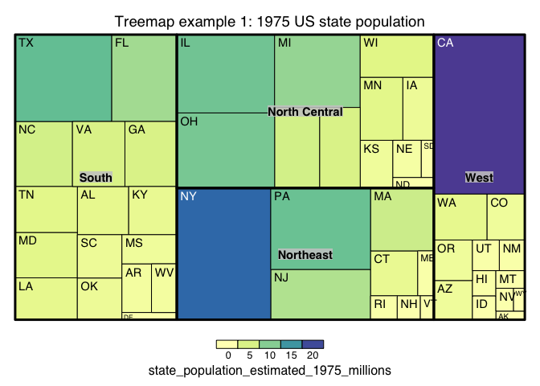
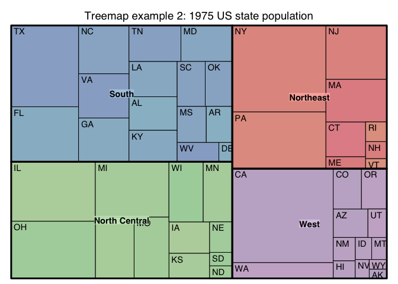

Treemap Visualizations
================

### Notebook objective

  - Explore using treemap visualizations to show hierarchical
    relationships and distributions

### Packages

``` r
required_packages <- c('tidyverse', 'treemap')
for(p in required_packages) {
  ### un-comment the below lines to install packages not installed
  # if(!require(p,character.only = TRUE))
  #       install.packages(p, repos = "http://cran.us.r-project.org")
  library(p,character.only = TRUE)
}
pct_formater_1 <- scales::label_percent(accuracy = 1)
```

### Load example dataset

  - data included with base R
  - warning population data values are estimates from 1975

<!-- end list -->

``` r
estimated_state_pop_1975 <- tibble(
      state_full_name = rownames(state.x77),
      # we need to divide pop value by "1000" to put the var on millions scale
      state_population_estimated_1975_millions = as.data.frame(state.x77)$Population/1000
)

state_df <- tibble(state_abb = state.abb,
       state_full_name = state.name,
       region = state.region) %>%
      left_join(estimated_state_pop_1975)
```

### States Treemap Example

``` r
treemap(state_df,
        index=c("region","state_abb"),
        vSize="state_population_estimated_1975_millions",
        vColor="state_population_estimated_1975_millions",
        type="value",
        palette = "Spectral",
        align.labels=list(c("center", "center"), c("left", "top")),
        title="Treemap example 1: 1975 US state population")
```

<!-- -->

``` r
treemap(state_df,
        index=c("region","state_abb"),
        vSize="state_population_estimated_1975_millions",
        type="index",
        palette = "Pastel1",
        align.labels=list(c("center", "center"), c("left", "top")),
        title="Treemap example 2: 1975 US state population")
```

<!-- -->

### Packages for inactive treemaps

  - [d3tree](https://cran.r-project.org/web/packages/d3Tree/d3Tree.pdf)
  - [plotly](https://cran.r-project.org/web/packages/plotly/plotly.pdf)

### Takeaways

  - Interactive plot likely needed for complex treemap
  - Proportionally small observations are hard to see on the plot
  - In practice, treemap usefulness will depend on the dataset and
    should be compared to vs bar chart simplicity
  - Pick the visualization that helps the audience get to
    insights/action fastest
